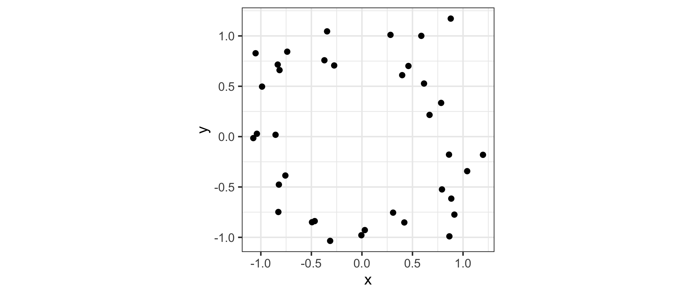

<!-- README.md is generated from README.Rmd. Please edit that file -->

# ggtda

[](https://codecov.io/github/tdaverse/ggtda?branch=main)
[](https://www.gnu.org/licenses/gpl-3.0)

[](https://CRAN.R-project.org/package=ggtda)
[](https://CRAN.R-project.org/package=ggtda)

## Overview

The **ggtda** package provides **ggplot2** layers for the visualization
of constructions and statistics arising from topological data analysis.

## Installation

The development version can be installed used the **remotes** package:

``` r
# install from GitHub
remotes::install_github("tdaverse/ggtda", vignettes = TRUE)
```

For an introduction to package functionality, read the vignettes:

``` r
# read vignettes
vignette(topic = "visualize-persistence", package = "ggtda")
vignette(topic = "illustrate-constructions", package = "ggtda")
vignette(topic = "grouped-list-data", package = "ggtda")
```

We aim to submit to [CRAN](https://CRAN.R-project.org) in Spring 2024!

## Example

``` r
# attach {ggtda}
library(ggtda)
#> Loading required package: rlang
#> Loading required package: ggplot2
```

### Sample data set

This example illustrates **ggtda** features using an artificial point
cloud $X$ sampled with noise from a circle:

``` r
# generate a noisy circle
n <- 36
set.seed(0)
t <- stats::runif(n = n, min = 0, max = 2*pi)
d <- data.frame(
  x = cos(t) + stats::rnorm(n = n, mean = 0, sd = .2),
  y = sin(t) + stats::rnorm(n = n, mean = 0, sd = .2)
)
# plot the data
ggplot(d, aes(x, y)) + geom_point() + coord_equal() + theme_bw()
```



### Topological constructions

**ggtda** provides stat and geom layers for common TDA constructions. To
illustrate, pick a proximity, or threshold, to consider points in the
cloud to be neighbors:

``` r
# choose a proximity threshold
prox <- 2/3
```

The homology $H_k(X)$ of a point cloud is uninteresting
($H_0(X) = \lvert X \rvert$ and $H_k(X) = 0$ for $k > 0$). The most
basic space of interest to the topological data analyst is the union of
a *ball cover* $B_r(X)$ of $X$—a ball of common radius $r$ around each
point. The common radius will be $r =$ `prox / 2`.

The figure below compares the ball cover (left) with the *Vietoris* (or
*Rips*) *complex* ${VR}_r(X)$ constructed using the same proximity
(right). The complex comprises a simplex at each subset of points having
diameter at most `prox`—that is, each pair of which are within `prox` of
each other. A key result in TDA is that the homology of the ball union
is “very close” to that of the complex.

``` r
# visualize disks of fixed radii and the Vietoris complex for this proximity
p_d <- ggplot(d, aes(x = x, y = y)) +
  coord_fixed() +
  geom_disk(radius = prox/2, fill = "aquamarine3") +
  geom_point() +
  theme_bw()
p_sc <- ggplot(d, aes(x = x, y = y)) +
  coord_fixed() +
  stat_simplicial_complex(diameter = prox, fill = "darkgoldenrod") +
  theme_bw() +
  theme(legend.position = "none")
# combine the plots
gridExtra::grid.arrange(
  p_d, p_sc,
  layout_matrix = matrix(c(1, 2), nrow = 1)
)
```


This cover and simplex clearly contain a non-trivial 1-cycle (loop),
which makes $H_1(B_r(X)) = H_1({VR}_r(X)) = 1$. But detecting this
feature depended crucially on the choice of `prox`, and there’s no
guarantee with new data that this choice will be correct or even that a
single best choice exists. Instead, we tend to be interested in
considering those features that persist across many values of `prox`.
The GIF below[^1] illustrates this point: Observe how features appear
and disappear as the disk covers grow:


### Persistent homology

Persistent homology (PH) encodes the homology group ranks across the
full range $0 \leq r < \infty$, corresponding to the full filtration of
simplicial complexes constructed on the point cloud. We use
[**ripserr**](https://cran.r-project.org/package=ripserr) to compute the
PH of the point cloud $X$:

``` r
# compute the persistent homology
ph <- ripserr::vietoris_rips(as.matrix(d), dim = 1)
print(ph)
#>    dimension     birth      death
#> 1          0 0.0000000 0.02903148
#> 2          0 0.0000000 0.05579919
#> 3          0 0.0000000 0.05754819
#> 4          0 0.0000000 0.06145429
#> 5          0 0.0000000 0.10973364
#> 6          0 0.0000000 0.11006440
#> 7          0 0.0000000 0.11076601
#> 8          0 0.0000000 0.12968679
#> 9          0 0.0000000 0.14783527
#> 10         0 0.0000000 0.15895889
#> 11         0 0.0000000 0.16171041
#> 12         0 0.0000000 0.16548606
#> 13         0 0.0000000 0.18487403
#> 14         0 0.0000000 0.22148925
#> 15         0 0.0000000 0.22522546
#> 16         0 0.0000000 0.23144975
#> 17         0 0.0000000 0.23833826
#> 18         0 0.0000000 0.24347463
#> 19         0 0.0000000 0.24621173
#> 20         0 0.0000000 0.24877669
#> 21         0 0.0000000 0.25618632
#> 22         0 0.0000000 0.27190520
#> 23         0 0.0000000 0.28831319
#> 24         0 0.0000000 0.30491738
#> 25         0 0.0000000 0.30827205
#> 26         0 0.0000000 0.31391084
#> 27         0 0.0000000 0.32506632
#> 28         0 0.0000000 0.32904677
#> 29         0 0.0000000 0.33786610
#> 30         0 0.0000000 0.34781266
#> 31         0 0.0000000 0.37754559
#> 32         0 0.0000000 0.41597062
#> 33         0 0.0000000 0.43867939
#> 34         0 0.0000000 0.46645722
#> 35         0 0.0000000 0.47084765
#> 36         1 0.6282155 1.39626210
```

The loop is detected, though we do not yet know whether its persistence
stands out from that of other features. To prepare for `ggplot()`, we
convert the result to a data frame and its numeric `dimension` column to
a factor:

``` r
pd <- as.data.frame(ph)
pd <- transform(pd, dimension = as.factor(dimension))
head(pd)
#>   dimension birth      death
#> 1         0     0 0.02903148
#> 2         0     0 0.05579919
#> 3         0     0 0.05754819
#> 4         0     0 0.06145429
#> 5         0     0 0.10973364
#> 6         0     0 0.11006440
tail(pd)
#>    dimension     birth     death
#> 31         0 0.0000000 0.3775456
#> 32         0 0.0000000 0.4159706
#> 33         0 0.0000000 0.4386794
#> 34         0 0.0000000 0.4664572
#> 35         0 0.0000000 0.4708476
#> 36         1 0.6282155 1.3962621
```

### Persistence plots

**ggtda** also provides stat and geom layers for common visualizations
of persistence data. We visualize these data using a barcode (left) and
a persistence diagram (right). In the barcode, the dashed line indicates
the cutoff at the proximity `prox`; in the persistence diagram, the
fundamental box contains the features that are detectable at this
cutoff.

``` r
# visualize the persistence data, indicating cutoffs at this proximity
p_bc <- ggplot(pd, aes(start = birth, end = death)) +
  geom_barcode(linewidth = 1, aes(color = dimension, linetype = dimension)) +
  labs(x = "Diameter", y = "Homological features",
       color = "Dimension", linetype = "Dimension") +
  geom_vline(xintercept = prox, color = "darkgoldenrod", linetype = "dotted") +
  theme_barcode()
max_prox <- max(pd$death)
p_pd <- ggplot(pd) +
  coord_fixed() +
  stat_persistence(aes(start = birth, end = death,
                       colour = dimension, shape = dimension)) +
  geom_abline(slope = 1) +
  labs(x = "Birth", y = "Death", color = "Dimension", shape = "Dimension") +
  lims(x = c(0, max_prox), y = c(0, max_prox)) +
  geom_fundamental_box(
    t = prox,
    fill = "darkgoldenrod", color = "transparent"
  ) +
  theme_persist()
# combine the plots
gridExtra::grid.arrange(
  p_bc, p_pd,
  layout_matrix = matrix(c(1, 2), nrow = 1)
)
```


The barcode lines are color- and linetype-coded by feature dimension:
the 0-dimensional features, i.e. the gaps between connected components,
versus the 1-dimensional feature, i.e. the loop. These groups of lines
do not overlap, which means that the loop exists only in the persistence
domain where all the data points are part of the same connected
component. Our choice of `prox` is between the birth and death of the
loop, which is why the complex above recovers it.

The persistence diagram shows that the loop persists for longer than any
of the gaps. This is consistent with the gaps being artifacts of the
sampling procedure but the loop being an intrinsic property of the
underlying space.

### Multiple data sets

TDA usually involves comparisons of topological data between spaces. To
illustrate such a comparison, we construct a larger sample and examine
the persistence of its cumulative subsets:

``` r
# larger point cloud sampled from a noisy circle
set.seed(0)
n <- 180
t <- stats::runif(n = n, min = 0, max = 2*pi)
d <- data.frame(
  x = cos(t) + stats::rnorm(n = n, mean = 0, sd = .2),
  y = sin(t) + stats::rnorm(n = n, mean = 0, sd = .2)
)
# list of cumulative point clouds
ns <- c(12, 36, 60, 180)
dl <- lapply(ns, function(n) d[seq(n), ])
```

First we construct a nested data frame containing these subsets and plot
their Vietoris complexes. (We specify the
[**simplextree**](https://github.com/peekxc/simplextree) engine and
restrict to 2-simplices to reduce runtime.)

``` r
# formatted as grouped data
dg <- do.call(rbind, dl)
dg$n <- rep(ns, vapply(dl, nrow, 0L))
# faceted plots of cumulative simplicial complexes
ggplot(dg, aes(x, y)) +
  coord_fixed() +
  facet_wrap(facets = vars(n), labeller = label_both) +
  stat_simplicial_complex(
    diameter = prox, dimension_max = 2L,
    engine = "simplextree",
    fill = "darkgoldenrod"
  ) +
  theme_bw() +
  theme(legend.position = "none")
```


The Vietoris complexes on these subsets for the fixed proximity are not
a filtration; instead they show us how increasing the sample affects the
detection of homology at that threshold. Notice that, while a cycle
exists at $n = 36$, the “true” cycle is only detected at $n = 60$.

We can also conveniently plot the persistence diagrams from all four
cumulative subsets, this time using a list-column of data sets passed to
the `dataset` aesthetic:

``` r
# nested data frame of samples of different cumulative sizes
ds <- data.frame(n = ns, d = I(dl))
print(ds)
#>     n            d
#> 1  12 c(1.0565....
#> 2  36 c(1.0565....
#> 3  60 c(1.0565....
#> 4 180 c(1.0565....
# faceted plot of persistence diagrams
ggplot(ds, aes(dataset = d)) +
  coord_fixed() +
  facet_wrap(facets = vars(n), labeller = label_both) +
  stat_persistence(aes(colour = after_stat(factor(dimension)),
                       shape = after_stat(factor(dimension)))) +
  geom_abline(slope = 1) +
  labs(x = "Birth", y = "Death", color = "Dimension", shape = "Dimension") +
  lims(x = c(0, max_prox), y = c(0, max_prox)) +
  theme_persist()
#> Warning: Removed 2 rows containing missing values or values outside the scale range
#> (`geom_point()`).
```


The diagrams reveal that a certain sample is necessary to distinguish
bona fide features from noise, as only occurs here at $n = 36$. While
the true feature retains about the same persistence (death value less
birth value) from diagram to diagram, the persistence of the noise
gradually lowers.

## Contribute

To contribute to **ggtda**, you can create issues for any bugs you find
or any suggestions you have on the [issues
page](https://github.com/tdaverse/ggtda/issues).

If you have a feature in mind you think will be useful for others, you
can also [fork this
repository](https://help.github.com/en/articles/fork-a-repo) and [create
a pull
request](https://help.github.com/en/articles/creating-a-pull-request).

[^1]: The GIF and many features of **ggtda** were originally developed
    in the separate package
    [**TDAvis**](https://github.com/jamesotto852/TDAvis).
